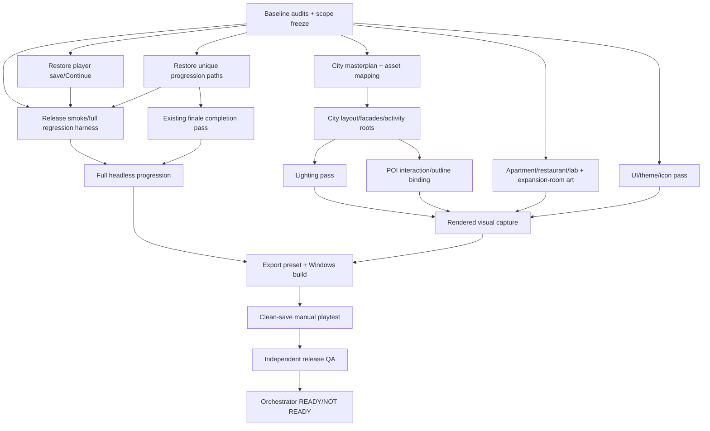

# Release hardening plan

Milestone: `RELEASE-RC-HARDENING-001`  
Final status vocabulary: `READY` or `NOT READY`.

## Execution state

`PLANNED — HANDOFF READY — IMPLEMENTATION PAUSED`

This document is the final Orchestrator plan. No further technical implementation is authorized in the main chat. Existing partial diffs must be reviewed by their assigned worker before continuation:

- `RC-BOOT-SAVE-001`: technically complete, pending independent QA.
- `RC-UNIQUE-PROGRESSION-001`: interrupted partial diff; not accepted.
- `RC-REGRESSION-FOUNDATION-001`: interrupted partial foundation; smoke passes, full mode not accepted.

## Sequential execution stages

### Stage 1 — Stabilize inherited partial work

**Task `RC-01-PARTIAL-REVIEW` — `df-gameplay-worker`**

- Goal: review, finish or correct only the existing partial diffs.
- Player flow: New Game → normal save → Continue; production discovery/contact/date for every existing non-algorithm unique; arcade reservation; smoke/full test launch.
- Writable: `scenes/boot/boot.gd`, `modules/girls/girls_api.gd`, `modules/city/city_api.gd`, `modules/dating/date_places.gd`, `tests/release/**`, `docs/release/AUTOTEST_RUNBOOK.md`, `docs/release/FULL_PLAYTHROUGH_CHECKLIST.md`.
- Read-only: save schema, ContentDB/stage data, finale gates, city scene.
- Forbidden: new girls/POI/stages, softened finale, direct test `mark_met`, Game/autoload/save-schema edits.
- PASS: 0 parse errors; normal Continue isolation; all unique production routes proven; smoke PASS; full runner fails honestly or passes without cheats.
- Evidence: diff, headless commands, raw logs, reports, limitations.

**Task `RC-01-QA` — `df-qa-worker`, only after implementation**

- Read-only independent check of normal/QA save isolation, unique route contracts and both test modes.
- PASS required before Stage 2.

### Stage 2 — Asset/license closure and city preparation

**Task `RC-02-ASSET-MAP` — `df-asset-worker`**

- Goal: exact source/license/prefab mapping for every existing facade and street activity in `CITY_MASTERPLAN.md`.
- Writable: selected new/imported files under `assets/environment/city/**`, `assets/props/**`, `assets/ui/**`; asset/license registry and `MISSING_ASSET_REPLACEMENTS.md`.
- Read-only: city scene/markers, Downloads source packs.
- Forbidden: whole-pack imports, format duplicates, gameplay/scenes, unverified download, new POI.
- PASS: source/license, one format, scale/pivot/material/collision and prefab evidence for each accepted asset; unresolved gaps documented.

**Task `RC-02-LICENSES` — `df-content-worker`**

- Goal: credits and license records for every shipped pack/font/audio source.
- Writable: credits/license documentation only.
- Forbidden: gameplay/content expansion.
- PASS: Sushi official source recorded, Outfit/DM Sans licenses present, drinkware resolved or marked for removal.

### Stage 3 — Rebuild the live city

**Task `RC-03-CITY` — `df-scene-worker`**

- Goal: implement the approved compact masterplan in the live `city.tscn`.
- Writable: live city scene only plus its dedicated city-prefab scenes if assigned explicitly.
- Read-only: marker/action contracts, imported assets.
- Forbidden: `complex_world.gd`, save/time/dating, new POI, editing legacy/testbed street as the result.
- PASS: residential/commercial/central/park/leisure/agency zones; two compact loops; progression side gates; all facades and activity props; hidden edges; collision; technical top-down evidence.

**Task `RC-03-INTEGRATION` — `df-gameplay-worker`, sequential after city scene**

- Goal: bind existing interactions, colliders, outline roots, prompts and anchors to their visual parent objects.
- Writable: `scenes/world/complex_world.gd`, `modules/interaction/interaction_router.gd` only.
- Forbidden: city scene, interaction framework rewrite, save/time/dating changes.
- PASS: facade/bench/ducks/karaoke/flower move as one root, soft gates work, repeated use returns control.

**Task `RC-03-QA` — `df-qa-worker`**

- Normal route, collision, outline, gate, activity and re-entry verification.

### Stage 4 — Lighting and existing location art

**Task `RC-04-LIGHT` — `df-scene-worker`**

- Goal: one authoritative readable environment with directional key, neutral ambient and restrained local accents.
- Writable: `complex.tscn` lighting/environment and assigned city local lights.
- Forbidden: time system redesign, second environment, random lamp proliferation.
- PASS: rendered evidence for every city zone, no purple wash/black void, readable entrances and shadows.

**Task `RC-04-ROOMS` — one or more non-overlapping `df-scene-worker` tasks**

- Goal: finish apartment regression, restaurant, lab, themed apartments and stage 2–6 rooms using existing packs.
- Writable: exactly one assigned scene/room implementation per worker; no shared `.tscn`.
- Forbidden: new travel architecture, new POI, visible blockout.
- PASS: entry/activity/exit/re-entry/save-load, player/girl placement, compact composition, no void.

### Stage 5 — UI and finale clarity

**Task `RC-05-UI` — `df-gameplay-worker` or `df-scene-worker` with one theme owner**

- Goal: unify all existing player-facing windows using the current theme.
- Writable: explicitly assigned UI files and global theme; one writer for global theme/project display settings.
- Forbidden: second UI framework, localization-system expansion, new feature tabs.
- PASS: no placeholders/default controls/mixed seed strings; modal/input/mouse return; 720p/1080p/1440p evidence.

**Task `RC-05-FINALE` — `df-gameplay-worker`**

- Goal: preserve existing stage_6/Algorithm mechanics and make completion understandable.
- Writable: existing finale UI/controller/quest integration only.
- Forbidden: softer gates, new ending system.
- PASS: completion summary, free play/menu choice, postgame save/load.

### Stage 6 — Regression, export and release evidence

**Task `RC-06-TESTS` — `df-gameplay-worker`**

- Goal: finish deterministic smoke/full runners.
- Writable: `tests/release/**` and test runbooks.
- Forbidden: production cheats exposed to player; direct forced met.
- PASS: auto-quit, raw log, concise report, non-zero FAIL, no orphan process; full route passes.

**Task `RC-06-EXPORT` — `df-gameplay-worker`**

- Goal: reproducible Godot 4.7.1 Windows export.
- Writable: `export_presets.cfg`, export scripts/docs only.
- Forbidden: gameplay changes, absolute runtime paths, debug/testbed inclusion.
- PASS: external build launch/new game/load/transitions/save/settings/quit; exact build path recorded.

**Task `RC-06-PLAYTEST` — `df-qa-worker`**

- Goal: clean-save ordinary-player playthrough and exported-build acceptance.
- Writable: QA reports/evidence only.
- PASS: full route to finale, all existing POI/activities, save/load/re-entry, screenshots and raw logs.

## Stage gate rule

Stages are integrated strictly in order. A later stage may be prepared read-only, but it cannot be accepted while an earlier Blocker/Critical gate remains. Every implementation stage ends with independent QA and Orchestrator review before ownership moves forward.

## Dependency graph

## Phase 0 — Baseline

Deliverables: six baseline documents, bug backlog, approved finale decision, city masterplan and this plan.

Exit:
- Three independent audits reviewed.
- Scope frozen.
- Blocker/Critical/Major baseline counted.
- No gameplay/scene fixes started before audit.

## Phase 1 — Critical gameplay

Packages:

1. `RC-BOOT-SAVE-001`: normal Continue, no-save disabled, QA entry test-only.
2. `RC-UNIQUE-PROGRESSION-001`: production discoverability/spawn for every existing unique required by finale.
3. `RC-REGRESSION-FOUNDATION-001`: release smoke harness and deterministic full-route skeleton without forced finale state.
4. `RC-DATING-VENUE-001`: correct arcade reservation identity and related capacity test.

Parallelism:
- Boot/save and unique progression may run in parallel because files do not overlap.
- Test harness may run concurrently only in new `tests/release/**` files.
- Save schema, Game autoload and finale state are single-writer.

Exit:
- 0 Blocker.
- New Game remains stage_1.
- Continue restores normal save.
- Every unique has a documented normal meet route.
- Headless regression proves these routes through production APIs.

## Phase 2 — City layout, facades and activities

Sequence:

1. Asset worker maps/imports the minimal facade/activity props.
2. One scene worker owns `city.tscn` and implements the approved compact loops.
3. Gameplay worker binds marker-driven interactions/outlines after the scene structure stabilizes.
4. Scene worker completes lighting after layout/art placement.

No parallel writers on `city.tscn`, `complex.tscn` or `complex_world.gd`.

Exit:
- Top-down evidence proves compact zones and loops.
- Every POI has facade, entrance, sign/detail and return relationship.
- Bench, ducks, karaoke and flower shop have complete physical staging.
- No ground labels or one-box facades remain.
- Player cannot see void or become trapped.

## Phase 3 — Existing separate scenes and progression rooms

Targets:
- Apartment interaction/visual regression only.
- Restaurant composition/date placement pass.
- Lab composition/lighting/clone route pass.
- Themed apartments and facility expansion rooms replace visible greyboxes using existing packs.

Independent `.tscn` files may be parallelized; procedural rooms in `complex_world.gd` remain one writer.

Exit:
- Each normal-route scene has entry, activity, exit, re-entry and save/load evidence.
- No visible default blockout.

## Phase 4 — UI and finale presentation

Reuse current theme. Fix player-facing strings, states, spacing, modal input, gift icons and three target resolutions. Finale retains existing mechanics and adds a clear summary plus free-play/menu choice.

Exit:
- No default grey controls or placeholders.
- Resolution/input matrix passes.
- Finale communicates completion and preserves postgame on save/load.

## Phase 5 — Regression, licenses and packaging

Deliverables:
- `tests/release/` smoke and full progression modes.
- `docs/release/AUTOTEST_RUNBOOK.md`.
- `docs/release/FULL_PLAYTHROUGH_CHECKLIST.md`.
- Source/license registry, credits and export include/exclude policy.
- `export_presets.cfg` and Windows build.

Exit:
- Headless tests auto-quit, write raw Godot logs/reports and return non-zero on FAIL.
- No test-only controls in release UI/build.
- Export excludes source archives, Blender working files, captures and testbeds.
- External build launches, saves, loads and exits cleanly.

## Phase 6 — Visual/manual/independent acceptance

Order:

1. Finish all headless checks.
2. One planned windowed capture run for city/POI/UI/animation evidence.
3. Orchestrator opens every claimed image.
4. Clean-save manual playthrough to finale.
5. Independent `df-qa-worker` release route.
6. Fix/retest loops scoped to failed criteria.

## File ownership policy

- Before each worker batch update `docs/agent/OWNERSHIP.md`.
- One active writer per file.
- City root, Game/autoload, save, global time, dating state machine, global theme and `project.godot` are sequential.
- Maximum three independent workers.
- Worker reports must include changed files, route, commands, raw logs, screenshots, limitations, unmet criteria and PASS/FAIL.

## Integration order

1. Save/Continue.
2. Girls/city progression.
3. Regression foundation.
4. City assets.
5. City scene.
6. Interaction bindings.
7. Lighting.
8. Separate scenes/rooms.
9. UI/finale.
10. Full regression.
11. Export.
12. Manual and independent QA.

## Checkpoints

- Baseline audit.
- Critical gameplay stable.
- City layout rebuilt.
- Street interactions complete.
- POI/room blockouts replaced.
- Lighting/UI unified.
- Regression tests pass.
- Finale route passes.
- Windows RC built and independently accepted.

No commit is created automatically while unrelated inherited WIP remains mixed; commits require an explicit clean staging decision.

## Stop criteria

Stop and report `NOT READY` if:

- a normal-route Blocker/Critical remains;
- save data is lost or QA profile leaks into shipping flow;
- required asset licensing cannot be verified;
- visual review cannot be performed;
- full progression or exported build fails;
- implementation would require a new major mechanic/architecture outside the frozen scope.

`READY WITH LIMITATIONS` is not an allowed result.
