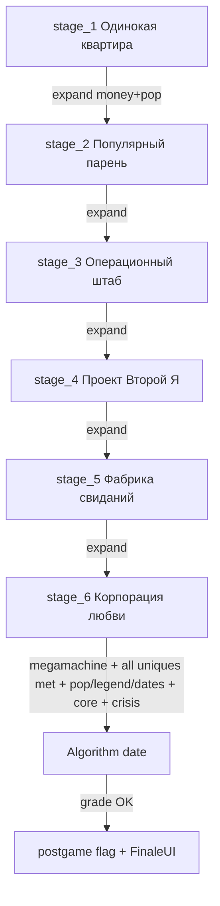

# RC-AUDIT-GAMEPLAY-001 — Gameplay / Technical Baseline Audit

**Date:** 2026-08-05  
**Project:** `C:\Users\User\Documents\GodotProjects\date_factory`  
**Scope:** read-only baseline before release hardening  
**Writable output:** this file only  
**Baseline includes uncommitted work:** QA full-access Continue routing + proxy girl POC assets/tools (treated as current tree state; not reverted)

---

## Executive summary

DATE FACTORY has a real playable vertical loop (boot → apartment FPS → phone scheduling → home/city dates → shops → city amenities → stage expansion → lab clones → orbital finale systems) with **0 GDScript parse errors** (96 scripts) and a **passing headless smoke** (`SMOKE_OK`).  

Release readiness is **not** claimed. Two structural Blockers sit in the current baseline:

1. **Boot «Продолжить» always loads the QA full-access profile**, not `user://save_slot_1.json`.
2. **Several unique girls required for finale have no city spawn / unlock path** (`GirlsAPI.try_unlock_by_progress` is a stub; city roster only anchors 4 of 11 non-algorithm uniques).

Finale/postgame **code exists** (`start_finale` → algorithm date → `FinaleUI` → `start_postgame`), but normal-route completion of all unique `met` gates is not evidenced from spawn/unlock wiring.

**Audit completeness:** PASS (see final verdict).  
**Game readiness:** NOT evaluated as READY (audit only).

---

## Existing flow

### Boot / entry

| Step | Code path | Evidence |
|---|---|---|
| Main scene | `project.godot` → `res://scenes/boot/boot.tscn` | project.godot |
| New Game | `boot.gd` `_new()` → `Game.new_game()` → `main.tscn` | stage_1 reset |
| Continue | `boot.gd` `_continue()` → `Game.load_full_access_qa_profile()` → `main.tscn` | **not** `load_game()` / `continue_or_new()` |
| Normal save APIs | `SaveService` `user://save_slot_1.json`; QA `user://save_slot_qa_full_access.json` | save_service.gd |
| Quick save/load | `Game` unhandled `quick_save` / `quick_load` | game.gd |

### Core player loop (stage_1 tutorial)

Documented by `QuestsAPI.STAGE1_MAIN_ORDER` + apartment POIs in `complex_world.gd`:

1. Phone (Q / nightstand) → neighbor profile  
2. Job on bed → city shops  
3. Wardrobe outfit  
4. Phone book date (home / cafe / restaurant…)  
5. Home table prep **or** city sit at venue  
6. Manual date UI → finish  
7. Talk to city girl → contact  
8. Popularity + expand door → stage_2  

### Dating / places

**Bookable places (`DatePlaces.places`):**  
`home`, `cafe`, `park`, `restaurant`, `cinema`, `arcade`, `apt_cozy`, `apt_modern`, `apt_creative`

**Phone booking:** home / cafe / restaurant / park / cinema / arcade / themed apt buttons (`phone_ui.gd`).  
**City sit (no-prep):** `sit_cafe`, `sit_park`, `sit_restaurant`, `sit_cinema`, `sit_arcade` → `InteractionRouter`.  
**Home prep:** fridge/drink/table → `prepare_and_start`.

### City districts & POIs

**Districts (`CityDistricts`):** `main_street`, `park_leisure`, `agency_row` (gates synced in complex_world).

**Main Street POIs:** home door, cafe Two Hearts, flower/jewelry/gift/clothing/homeware shops.  
**Park Leisure:** picnic, restaurant, gym + pass, bookstore, cinema, arcade (+ sit).  
**Agency Row:** photo studio, barber, agency board.

### Facility progression rooms (expand corridor)

Built in `complex_world.gd` match arms:  
`apartment` (art), `neighbor_apt`, `office_nook`, `agency`, `mansion`, `factory`, `orbital`, plus exclusive travel zones `lab` (art), `apt_*`.

### Clones

Lab POIs `create_clone` → `ClonesAPI.begin_acceptance` / decide → assign to auto dates.  
Gated by scientist met **or** `unlock_clones` effect.

### Finale (exists in code)

Orbital stations + megamachine (`finale_station`, `start_finale`) → gates in `_start_finale` / `unlock_algorithm_if_ready` → algorithm manual date → HUD on grade≥2 → `start_postgame` + `FinaleUI.open()`.

---

## Progression graph



### Stage packs (`ContentPacksProgress.stages`)

| Stage | next_cost | pop need (for next) | Rooms unlocked | Venues unlocked | Girls listed in stage data |
|---|---|---|---|---|---|
| stage_1 | 60 | 5 → s2 | apartment, neighbor_apt, lab | kitchen_table, cheap_cafe | neighbor |
| stage_2 | 200 | 20 → s3 | +office_nook | +park | +fitness, goth, streamer |
| stage_3 | 500 | 50 → s4 | +agency | +cinema_room, restaurant, photo_studio | +business, fashionista, chef, scientist |
| stage_4 | 1200 | 110 → s5 | +mansion | +luxury_hall, lab_capsule | +lawyer |
| stage_5 | 3000 | 220 → s6 | +factory | +conveyor | +star, alien |
| stage_6 | 0 / no next | — | +orbital | +orbital_hall | +algorithm |

**Actual last progression stage:** `stage_6` (`unlock_next: ""`).  
**Postgame:** boolean `Game.postgame` + quest fallback `pg_continue`; balance lists `postgame_goals` but no dedicated tracker UI/API completion loop was found beyond toast/flags.

### Quest lines (HUD)

- s1: 8 main steps  
- s2: girls / hire / venues / expand  
- s3: scientist / staff / lab expand  
- s4: clone / parallel / harem side / factory  
- s5: conveyor / alien / PR / orbit  
- s6: mega parts / algorithm / finale date  

---

## Feature inventory (from code/scenes — not guesses)

### Autoloads / façade

GodotIQ `project_summary`: `GodotIQRuntime`, `EventBus`, `SettingsService`, `Game`.  
Additional runtime services used from scripts: `Sfx`, theme helpers (not in brief autoload list — confirm in `project.godot` when hardening).

### Modules under `Game`

| System | File | Role |
|---|---|---|
| Economy | economy_api.gd | money, attention, scandal, popularity, legend, job |
| Inventory | inventory_api.gd | gifts, outfits, carried |
| Girls | girls_api.gd | contacts, bond, claim, algorithm gates |
| Dating | dating_api.gd + date_schedule + date_places | book/start/finish manual+auto |
| Facility | facility_api.gd | rooms/venues/flags/mega_parts/expand |
| Clones | clones_api.gd | create/accept/assign/errors |
| Staff | staff_api.gd | hire roles |
| Upgrades | upgrades_api.gd | buy effects |
| Events | events_api.gd | timed choice events |
| Quests | quests_api.gd | stage goals + stage_1 gates |
| City | city_api.gd + city_districts | districts, amenities, roster, talk |
| Crises | crises_api.gd | spatial crises |
| Trait influence | trait_influence_api.gd | orbit/branches |
| Time | time_api.gd | day/minutes |
| Save | save_service.gd + full_access_qa_profile.gd | slots |
| Names | names_api.gd | display names |
| Interaction | interaction_router.gd + interactable.gd | world actions |

### ContentDB counts (smoke_test)

`gifts=27`, `upgrades=91`, `events=31`, `rooms=11`, venues≥10, girls≥12, outfits≥11.

### Unique girls (`ContentPacks.girls`)

`neighbor`, `fitness`, `goth`, `streamer`, `business`, `fashionista`, `chef`, `lawyer`, `scientist`, `star`, `alien`, `algorithm`.

**City spawn anchors (`city_api` roster):** only `fitness`, `goth`, `streamer`, `chef` (+ many `city_*` procedural-like fixed city girls).  
`neighbor` starts as contact. Others rely on missing unlock wiring.

### Shops (`DatePlaces.shop_catalog`)

flower_shop, jewelry_shop, gift_shop, clothing_shop, homeware_shop, bookstore.

### Staff roles implemented

messenger, stylist, buyer, coordinator, pr, tech, lawyer_staff (7). Design catalog mentions 10.

### Crises (sample IDs)

lights_out, stuck_door, gift_wrong_hall, two_yous, clone_freeze, early_guest, journalist, memory_desync, …

### UI scenes (player-facing)

boot, main, hud, phone_ui, date_ui, shop_ui, event_ui, finale_ui, pause/settings, elevator, district_gate, gym/arcade/photo/barber/agency/clone_accept, transition/reveal.

### Art-backed locations

Apartment kit, City_Street_Slice, Sushi restaurant / restaurant slice, Clone_Lab_Base.  
Expansion rooms (office/agency/mansion/factory/orbital) are **code-built interact volumes** (placeholder risk for release polish).

### Tests / tools

| Asset | Role |
|---|---|
| `tools/smoke_test.gd` | headless module smoke + save/load + forced finale path |
| `tools/playtest_m17.gd` | additional headless playtest |
| Art testbeds / proxy POC | non-route scenes |
| GodotIQ check_errors / validate | editor-side |

### Export

**No `export_presets.cfg` in repo.** Prior polish doc marks exportable demo as TODO.

---

## Problem register

Severity: **Blocker** / **Critical** / **Major** / **Minor**.

### P01 — Continue bypasses player save (QA wired as default)

| | |
|---|---|
| **Severity** | **Blocker** (for any player-facing release) |
| **Repro** | Boot → «Продолжить» |
| **Evidence** | `scenes/boot/boot.gd` lines 13–14, 39–41: always `Game.load_full_access_qa_profile()`; comment says Continue = QA. `Game.continue_or_new()` / `load_game()` unused by menu. |
| **Owner** | df-gameplay-worker (boot/save) |
| **Regression** | QA-FULL-ACCESS-SAVE-001; normal save re-entry |

### P02 — Unique girls required for finale lack spawn/unlock path

| | |
|---|---|
| **Severity** | **Blocker** (normal-route finale) |
| **Repro** | New Game → progress stages → search city/phone for scientist/business/fashionista/lawyer/star/alien |
| **Evidence** | `GirlsAPI.try_unlock_by_progress()` body is `pass`. City `_build_roster` only `_unique_anchor` for fitness/goth/streamer/chef. `profiles_for_spawn` iterates roster only. Finale `_finale_gates_ok` requires **every** ContentDB girl except algorithm to be `met`. |
| **Owner** | df-gameplay-worker (girls/city) |
| **Regression** | stage_3 scientist quest; clones gate; s6_algo / finale |

### P03 — No export presets / export pipeline

| | |
|---|---|
| **Severity** | **Major** (release packaging) |
| **Repro** | Search repo for `export_presets.cfg` → absent |
| **Evidence** | Glob 0 files; `docs/FINAL_POLISH_REPORT.md` item 18 TODO |
| **Owner** | Orchestrator + packaging |
| **Regression** | first Windows export |

### P04 — Finale feel / postgame goals incomplete

| | |
|---|---|
| **Severity** | **Major** (ending clarity) |
| **Repro** | Reach algorithm date (if gates satisfied) → FinaleUI short overlay; postgame quest is generic |
| **Evidence** | FinaleUI exists; `postgame_goals` in balance not wired to quest completion API; polish report «Finale feels like ending = PARTIAL» |
| **Owner** | df-content-worker / df-gameplay-worker |
| **Regression** | s6_finale, FinaleUI |

### P05 — Expansion rooms are procedural placeholders vs art locations

| | |
|---|---|
| **Severity** | **Major** (visual/product quality) |
| **Repro** | Expand to office_nook / agency / mansion / factory / orbital |
| **Evidence** | `complex_world.gd` builds interactables in empty volumes; art kits exist for apt/city/lab/restaurant only |
| **Owner** | df-scene-worker |
| **Regression** | stage expand travel |

### P06 — Arcade date maps to `cheap_cafe` venue_id

| | |
|---|---|
| **Severity** | **Major** (balance / venue capacity collisions) |
| **Repro** | Book arcade; inspect schedule `venue_id` |
| **Evidence** | `date_places.gd` arcade `"venue_id": "cheap_cafe"` |
| **Owner** | df-gameplay-worker (dating) |
| **Regression** | sit_arcade / occupancy |

### P07 — Content catalog gaps vs design doc

| | |
|---|---|
| **Severity** | **Major** (scope honesty) |
| **Evidence** | Events 31 vs ≥40; staff 7 vs 10; unique spawn incomplete; cinema_room venue vs city cinema place duality |
| **Owner** | Orchestrator / content |
| **Regression** | content completeness checklist |

### P08 — Boot Continue always enabled even without saves

| | |
|---|---|
| **Severity** | **Major** (UX; related to P01) |
| **Evidence** | `continue_button.disabled = false` always |
| **Owner** | df-gameplay-worker |
| **Regression** | boot menu |

### P09 — GodotIQ validate: 103 warnings / 0 errors

| | |
|---|---|
| **Severity** | **Minor**–**Major** aggregate (mostly missing class_name / null checks) |
| **Evidence** | `godotiq_validate(project)` → errors 0, warnings 103, info 33 |
| **Owner** | cleanup pass |
| **Regression** | style gate |

### P10 — QA profile regeneration non-byte-stable

| | |
|---|---|
| **Severity** | **Minor** (known) |
| **Evidence** | QA-FULL-ACCESS-SAVE-001_QA: sha256 changes (volatile fields) |
| **Owner** | save/QA |
| **Regression** | QA hash asserts |

### P11 — Proxy POC / testbeds in tree

| | |
|---|---|
| **Severity** | **Minor** for shipping if excluded; **Major** if accidentally main-routed |
| **Evidence** | Untracked proxy GLB/testbeds; not main_scene |
| **Owner** | df-asset-worker |
| **Regression** | export include filters |

### P12 — Script parse / smoke healthy

| | |
|---|---|
| **Severity** | N/A (positive) |
| **Evidence** | `check_errors(project)` total 0; smoke `SMOKE_OK` |

---

## Minimal finale options (existing mechanics only — no product pick)

Options Orchestrator may choose among; **not** recommended here:

1. **Restore unique unlocks:** implement `try_unlock_by_progress` from stage `girls` + `popularity_need`, and/or add city `_unique_anchor` for all ContentDB uniques → keep current hard finale gates.  
2. **Spawn-only fix:** extend city roster anchors for business/fashionista/lawyer/scientist/star/alien; keep talk→contact→date→met.  
3. **Soften algorithm gates:** change `_finale_gates_ok` to subset (e.g. megamachine + stage_6 + legend) using existing flags — still uses FinaleUI/postgame.  
4. **Soft ending without algorithm:** on megamachine ready + `finale_core_ready`, call existing `Game.start_postgame()` + FinaleUI (HUD/router already have hooks).  
5. **QA/debug path as temporary demo end:** Continue full-access already grants scientist/met resources — **not** a player finale, only demo shortcut.

---

## Relevant files

| Area | Paths |
|---|---|
| Boot / save | `scenes/boot/boot.gd`, `autoload/game.gd`, `modules/save/*` |
| World / POIs | `scenes/world/complex_world.gd`, `modules/interaction/interaction_router.gd` |
| Dating | `modules/dating/*`, `scenes/ui/phone_ui.gd`, `scenes/ui/date_ui.gd` |
| Progression | `core/content_packs_progress.gd`, `modules/facility/facility_api.gd`, `modules/quests/quests_api.gd` |
| Girls / city | `modules/girls/girls_api.gd`, `modules/city/city_api.gd` |
| Clones | `modules/clones/clones_api.gd`, lab scene |
| Finale | `interaction_router._start_finale`, `scenes/ui/finale_ui.gd`, `scenes/ui/hud.gd`, `scenes/boot/main.gd` |
| Content | `core/content_db.gd`, `core/content_packs.gd`, `core/content_packs_progress.gd` |
| Tests | `tools/smoke_test.gd`, `tools/playtest_m17.gd` |
| Prior polish | `docs/FINAL_POLISH_REPORT.md`, `docs/10_CONTENT_CATALOG.md` |

---

## Reusable systems

- `Game` façade + module `to_dict`/`from_dict` save graph  
- `InteractionRouter` action dispatch  
- `DatePlaces` + `DateSchedule` booking model  
- `ContentDB` static catalogs  
- `EventBus` toast/notify/stage/finale signals  
- `CityAPI` district gates + amenity cooldowns  
- `CrisesAPI` spatial fixes (also pre-finale)  
- `FullAccessQaProfile` unlock matrix (QA only)  
- Headless `smoke_test.gd` as regression harness  

---

## Integration boundaries

| Boundary | Rule |
|---|---|
| Boot menu ↔ Save | Currently QA-only Continue; player save must not share QA path |
| Facility rooms ↔ ComplexWorld | unlock lists drive which zones build/travel |
| DatePlaces ↔ Facility venues | place_id → venue_id; capacity/reserve |
| City talk ↔ Girls contacts | only roster-spawned IDs reachable without unlock stub |
| Clones ↔ Scientist / effects | create gated |
| Finale ↔ Girls+Facility+Crises+Dating | multi-module AND gates |
| Trait influence ↔ Phone Orbit tab | mid/late progression |
| Art scenes ↔ procedural rooms | do not double-edit same `.tscn` across workers |

---

## Risks

1. Shipping with P01 ships a cheat Continue, not Continuity.  
2. P02 makes stage_3–6 quest text / finale mathematically unreachable on New Game.  
3. Placeholder expansion rooms fail placeholder policy for “итог”.  
4. No export presets → cannot produce verified build.  
5. Smoke test **forces** mark_met all girls — **false confidence** vs player route.  
6. Uncommitted proxy POC + QA changes muddy release branch hygiene.  
7. Arcade/cafe venue_id collision may cause occupancy bugs under automation.  
8. Visual QA not run in this audit (policy).  

---

## Recommended ownership (hardening packages)

| Package | Agent | Writable focus | Forbidden |
|---|---|---|---|
| RC-BOOT-SAVE-RESTORE | df-gameplay-worker | `boot.gd`, save routing | QA profile deletion; complex_world |
| RC-UNIQUE-UNLOCK | df-gameplay-worker | `girls_api.gd`, `city_api.gd` roster | dating_api rewrite |
| RC-FINALE-SOFTEN-OR-WIRE | Orchestrator decision → gameplay | finale gates / quests | redesign narrative |
| RC-EXPORT | packaging | `export_presets.cfg`, include filters | gameplay systems |
| RC-ROOM-ART | df-scene-worker | expansion room presentation | save schema |
| RC-SMOKE-PLAYER-ROUTE | df-qa-worker | headless route tests without forced mark_met | production content |
| RC-PROXY-HYGIENE | df-asset-worker | keep POC out of export | gameplay |

---

## Acceptance evidence (for future hardening — not claiming READY)

| Check | Command / method | This audit |
|---|---|---|
| Parse | GodotIQ `check_errors(project)` | **0 errors / 96 scripts** |
| Conventions | `validate(project)` | 0 errors, 103 warnings |
| Module smoke | headless `tools/smoke_test.gd` | **SMOKE_OK** (log below) |
| Import | headless `--import --quit` | completed (GodotIQ WS port busy warning only) |
| Player Continue | boot → load_slot_1 | **FAIL expected (P01)** — not retested visually |
| Unique meet path | city spawn scientist | **FAIL expected (P02)** — static code proof |
| Visual tour | windowed | **NOT RUN** (brief) |
| Export | export_presets | **MISSING** |

---

## Minimal finale — acceptance checks if chosen later

- New Game can reach last stage without QA profile  
- Every ContentDB unique except algorithm has a documented meet path  
- Megamachine 3 parts + core station + crisis clear work  
- Algorithm date OR chosen soft-end opens FinaleUI and sets `postgame`  
- Save/load after postgame keeps `postgame` + stage_6  
- Headless test without forced `mark_met` of all girls  

---

## Commands and logs executed

### GodotIQ

- `godotiq_project_summary(detail=brief)` → 47 scenes, 96 scripts, 1098 assets; autoloads listed  
- `godotiq_check_errors(scope=project)` → `total: 0`  
- `godotiq_validate(target=project, detail=brief|normal)` → 136 issues, 0 error severity  
- `godotiq_file_context` on Game, boot, quests, facility, dating, clones, city, inventory, finale, save, ContentDB  
- `godotiq_asset_registry(category=scenes, detail=brief)` → 47 scenes, used 21 / unused 26 (usage heuristic)

### Headless Godot (`C:\godot\Godot_v4.7.1-stable_win64.exe`)

```text
# Smoke
& "C:\godot\Godot_v4.7.1-stable_win64.exe" --headless --path "C:\Users\User\Documents\GodotProjects\date_factory" --script "res://tools/smoke_test.gd" --log-file "C:\Users\User\Documents\GodotProjects\date_factory\docs\release\research\_smoke_audit.log" --quit-after 60
```

**Stdout / log (`_smoke_audit.log`):**

```text
Godot Engine v4.7.1.stable.official.a13da4feb - https://godotengine.org
[GodotIQ] Runtime _ready() — debugger active: false
[GodotIQ] Debugger not active, freeing runtime
SMOKE_OK gifts=27 upgrades=91 events=31 rooms=11
```

```text
# Import check
& "C:\godot\Godot_v4.7.1-stable_win64.exe" --headless --path "..." --import --quit
```

Note: `ERROR: GodotIQ: Failed to start WebSocket server on port 6007` — expected while editor GodotIQ already bound; import still DONE.

### Not run

- Windowed visual capture  
- Full New Game → finale soak  
- Export build  

---

## Baseline notes (uncommitted tree)

Included in baseline intentionally:

- QA Continue → `FullAccessQaProfile`  
- `modules/save/full_access_qa_profile.gd`  
- Proxy girl POC assets/tools/testbeds  
- Modified `boot.gd` / `game.gd` / save_service  

Do not treat QA Continue as the intended shipping Continue without an explicit Orchestrator decision.

---

## Audit verdict

| Criterion | Result |
|---|---|
| Feature inventory from code | Done |
| Flow / progression / finale presence | Done |
| Problem list with severity/repro/evidence/owner | Done |
| Tests / export risks | Done |
| Headless technical checks | Done |
| Visual run | Out of scope (noted) |
| **PASS/FAIL = audit completeness** | **PASS** |

Game shipping readiness: **NOT READY** (informational; not the audit grade).
